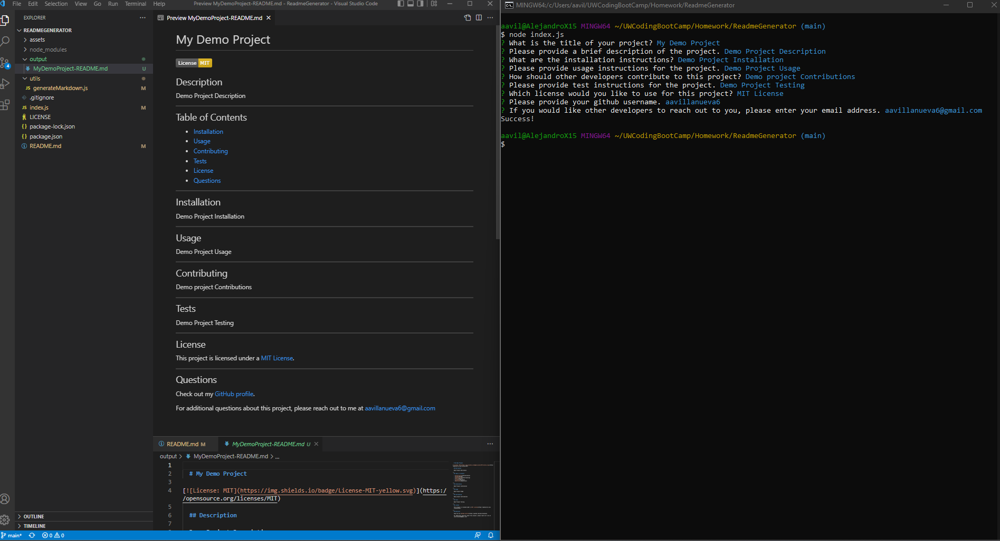

# Readme Generator in node

## Description

The purpose of this project was to build an application for a user to be prompted with questions about their project, so that the application could generate a professional readme file for the user.

This application runs in node.js.

---

## Table of Contents

- [Installation](#installation)
- [Usage](#usage)
- [Contributing](#contributing)
- [Tests](#tests)
- [License](#license)
- [Questions](#questions)

---

## Installation

node.js is required for the application. The application was built on node v16.14.2.

---

## Usage

Run index.js from node and follow the prompts.

---

## Screenshots / Demo

A screenshot of the application functionality is presented below. The screenshot shows the prompts answered with placeholder text and the MIT License selected. It also shows the generated README from the user input:

A demo of the application functionality is at the following link:
<https://www.youtube.com/watch?v=BlkZacjU_zU>

Samples of generated readme files using this application are located in the output folder as "MyDemoProject(withlicense)-README.md" and "MyDemoProject(withoutlicense)-README.md".

---

## License

This project is licensed under a [MIT License](https://opensource.org/licenses/MIT).

---

## Questions

Check out my [GitHub profile](https://github.com/aavillanueva6).

For additional questions about this project, please reach out to me at <aavillanueva6@gmail.com>
